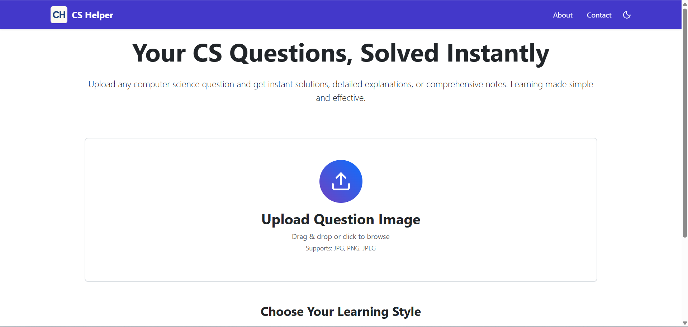
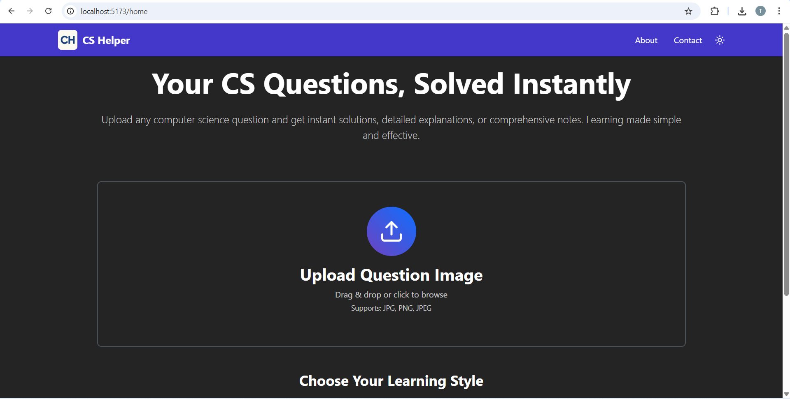
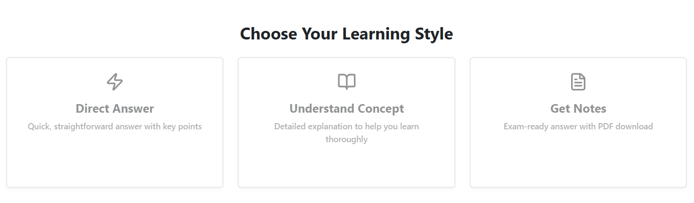
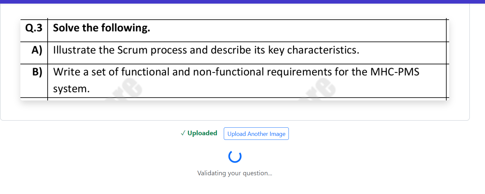
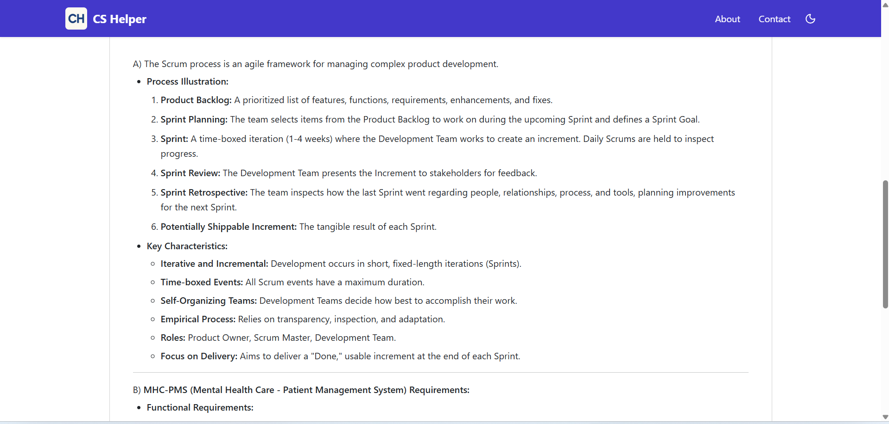
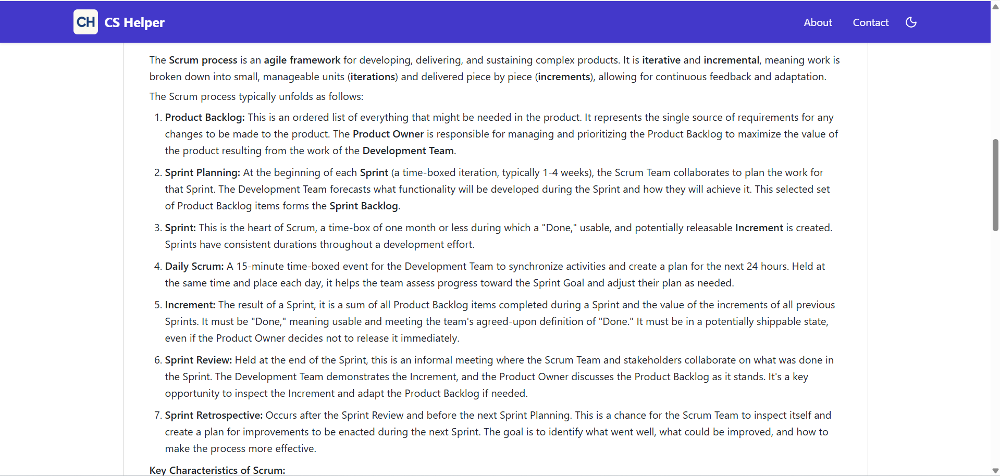
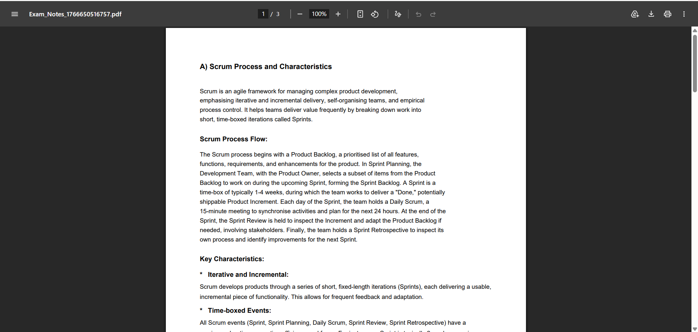
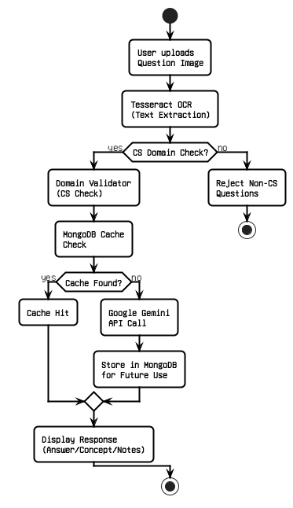

# CS Helper

A web-based platform that enables university students to upload images of Computer Science questions and receive instant solutions in three formats: direct answers, detailed concept explanations, or comprehensive PDF-ready notes. Built with React, Node.js, and powered by Google Gemini AI with intelligent MongoDB caching.

---

## 📸 Demo

### Screenshots


*Homepage with drag-and-drop upload interface*


*Light and Dark mode support*


*Three learning modes: Direct Answer, Concept Explanation, and PDF Notes*


*Automatic CS domain validation*


*Direct Answer*


*Detailed-Answer*


*PDF_Generation*
### Video Demo

🎥 **[Watch Full Demo Video](https://drive.google.com/file/d/1TgycjdQTufcAK-tQAJJWb-xDQPt13GfM/view?usp=sharing)**

---

## ✨ Features

- **Image Upload Interface** - Drag-and-drop support for question images (JPEG, PNG)
- **Domain Validation** - Automatically detects if the uploaded question belongs to Computer Science domain using keyword matching
- **OCR Text Extraction** - Tesseract OCR extracts text from uploaded images
- **Three Learning Modes:**
  - Direct Answer - Concise solution
  - Concept Explanation - Detailed step-by-step breakdown
  - PDF Notes - Comprehensive study material
- **Smart Caching System** - MongoDB stores previously answered questions for instant retrieval
- **Light & Dark Mode** - Toggle between themes for comfortable viewing
- **University-Level Focus** - Designed for higher education CS curriculum

---

## 🏗️ Architecture


The system follows this workflow:

1. **Image Upload** → User uploads question image
2. **OCR Processing** → Tesseract extracts text from image
3. **Domain Validation** → System checks against CS keywords to validate domain
4. **Cache Check** → MongoDB searches for previously answered similar questions
5. **AI Processing** → If not cached, Google Gemini API generates response
6. **Response Storage** → New answers stored in MongoDB for future queries
7. **Display** → User receives formatted response based on selected mode

---

## 🛠️ Tech Stack

### Frontend
- **React.js (with Vite)** - User interface
- **Bootstrap 5** - Responsive styling and components
- **Tesseract.js** - Client-side OCR
- **Axios** - API communication

### Backend
- **Node.js** - Runtime environment
- **Express.js** - Web framework
- **Mongoose** - MongoDB object modeling

### Database & AI
- **MongoDB** - NoSQL database for query caching
- **Google Gemini API** - AI-powered response generation
- **Tesseract OCR** - Text extraction from images

---

## 📦 Installation

### Prerequisites

- Node.js (v18 or higher)
- MongoDB (local installation or MongoDB Atlas account)
- Google Gemini API key ([Get it here](https://ai.google.dev/gemini-api/docs/api-key))

### Step 1: Clone the Repository

```bash
git clone https://github.com/Taniya-1234/CS-Helper.git
cd cs-helper
```

### Step 2: Backend Setup

```bash
cd backend
npm install
```

Create a `.env` file in the backend directory:

```env
MONGODB_URI=your_mongodb_connection_string
GEMINI_API_KEY=your_gemini_api_key
```

Start the backend server:

```bash
nodemon server.js
```

### Step 3: Frontend Setup

```bash
cd frontend
npm install
```

Create a `.env` file in the frontend directory:

```env
VITE_BACKEND_URL=http://localhost:5000
```

Start the React application:

```bash
npm run dev
```

### Step 4: Access Application

Open your browser and navigate to:
```
http://localhost:5173
```

---

## 🚀 Usage

1. **Upload Question Image**
   - Click the upload area or drag and drop an image containing a CS question
   - Supported formats: JPEG, PNG

2. **Domain Validation**
   - System automatically validates if the question belongs to CS domain
   - Non-CS questions will be rejected with an error message

3. **Select Learning Mode**
   - Choose one of three options:
     - **Direct Answer** - Quick solution
     - **Understand Concept** - Detailed explanation
     - **Get Notes** - Comprehensive PDF-ready notes

4. **View Response**
   - AI-generated response displays based on your selection
   - Response is cached in MongoDB for future queries

> **Testing Tip:** Sample questions are available in the `/sample-questions/` folder for quick testing.

---

## 📁 Project Structure

```
cs-helper/
├── backend/
│   ├── data/
│   ├── models/
│   ├── node_modules/
│   ├── ocr/
│   ├── routes/
│   ├── uploads/
│   ├── utils/
│   ├── .env
│   ├── .gitignore
│   ├── eng.traineddata
│   ├── keywordMatcher.js
│   ├── package-lock.json
│   ├── package.json
│   └── server.js
├── frontend/
│   ├── node_modules/
│   ├── public/
│   ├── src/
│   ├── .env
│   ├── .gitignore
│   ├── eslint.config.js
│   ├── index.html
│   ├── package-lock.json
│   ├── package.json
│   └── vite.config.js
├── sample-questions/
└── README.md
```

---

## 🔮 Future Enhancements

- [ ] Support for handwritten question recognition
- [ ] Expand to other subjects (Mathematics, Physics, Engineering)
- [ ] User authentication and personal query history
- [ ] Mobile application (iOS & Android)
- [ ] Real-time collaboration features
- [ ] Code execution environment for programming questions
- [ ] Multi-language support

---

## 🤝 Contributing

Contributions are welcome! To contribute:

1. Fork the repository
2. Create a feature branch (`git checkout -b feature/YourFeature`)
3. Commit your changes (`git commit -m 'Add YourFeature'`)
4. Push to the branch (`git push origin feature/YourFeature`)
5. Open a Pull Request

---

## 👨‍💻 About the Developer

**[Taniya Ghuse]**

I'm a full-stack developer passionate about building educational technology solutions. CS Helper was developed to help university students get instant learning support for Computer Science questions.

- 🔗 LinkedIn: [Taniya Ghuse](https://www.linkedin.com/in/taniya-ghuse/)
- 🐙 GitHub: [Taniya-1234](https://github.com/Taniya-1234)

---

<div align="center">

**If you find this project helpful, please consider giving it a ⭐ star!**

</div>
